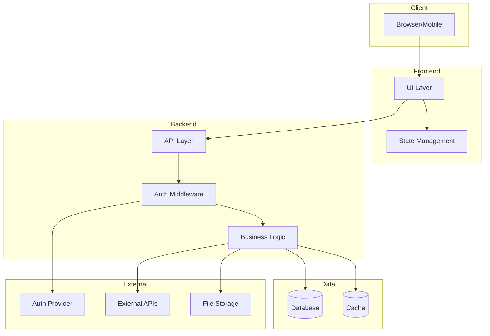
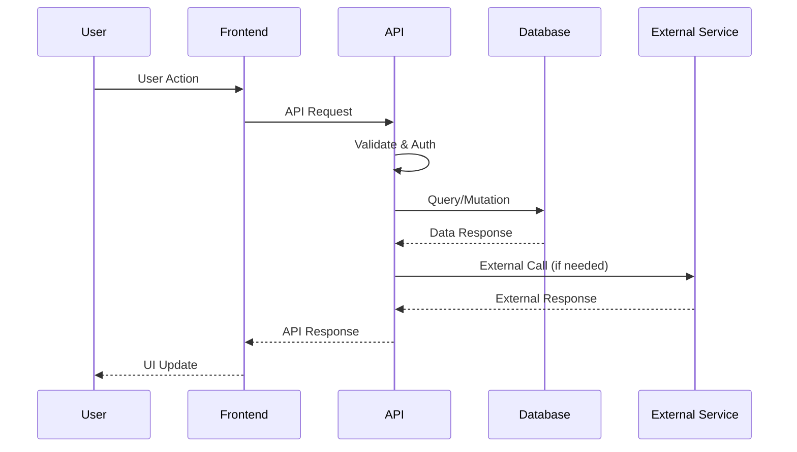
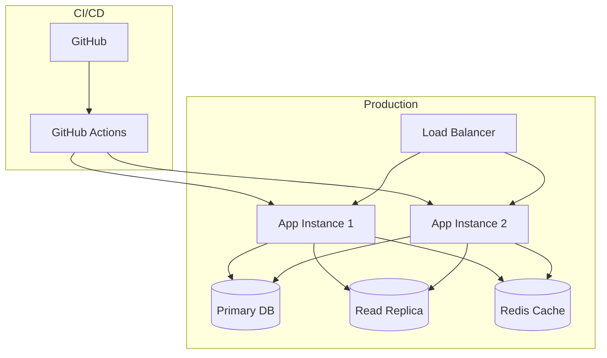
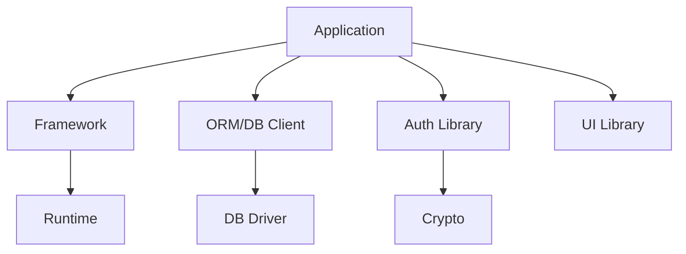

# Tech Architecture

> **Last Updated**: YYYY-MM-DD
> **Updated After Sprint**: `vX.Y.Z-focus-slug`
> **Next Review**: After current sprint completes

## Tech Stack Overview

| Layer | Technology | Version | Purpose |
|-------|------------|---------|---------|
| **Frontend** | [React/Vue/Svelte] | vX.Y | UI framework |
| **Meta-Framework** | [Next.js/Nuxt/SvelteKit] | vX.Y | SSR, routing |
| **Styling** | [Tailwind/MUI/CSS Modules] | vX.Y | UI styling |
| **Backend** | [Node.js/Python/Go] | vX.Y | Server runtime |
| **API Framework** | [Express/FastAPI/Gin] | vX.Y | HTTP handling |
| **Database** | [PostgreSQL/MongoDB] | vX.Y | Data persistence |
| **ORM/Client** | [Prisma/Mongoose/GORM] | vX.Y | DB interface |
| **Auth** | [NextAuth/Passport/Custom] | vX.Y | Authentication |
| **Testing** | [Jest/Vitest/Pytest] | vX.Y | Test framework |
| **CI/CD** | [GitHub Actions/CircleCI] | N/A | Automation |

---

## System Architecture Diagram



---

## Data Flow Diagram



---

## Component Relationships

```mermaid
graph LR
    subgraph Feature Areas
        Auth[Authentication]
        Dashboard[Dashboard]
        Settings[Settings]
        [FeatureX]
    end

    subgraph Shared
        UI[UI Components]
        Utils[Utilities]
        Hooks[Custom Hooks]
        API[API Client]
    end

    Auth --> UI
    Auth --> API
    Dashboard --> UI
    Dashboard --> Hooks
    Dashboard --> API
    Settings --> UI
    Settings --> API
    [FeatureX] --> UI
    [FeatureX] --> Hooks
```

---

## Database Schema Overview

```mermaid
erDiagram
    User ||--o{ Session : has
    User ||--o{ [Entity] : owns
    [Entity] ||--o{ [SubEntity] : contains

    User {
        uuid id PK
        string email
        string name
        datetime created_at
    }

    Session {
        uuid id PK
        uuid user_id FK
        datetime expires_at
    }

    [Entity] {
        uuid id PK
        uuid user_id FK
        string name
        datetime created_at
    }
```

---

## API Structure

### REST Endpoints (if applicable)

| Method | Endpoint | Purpose | Auth Required |
|--------|----------|---------|---------------|
| GET | `/api/health` | Health check | No |
| POST | `/api/auth/login` | User login | No |
| GET | `/api/users/me` | Current user | Yes |
| GET | `/api/[resource]` | List resources | Yes |
| POST | `/api/[resource]` | Create resource | Yes |
| PUT | `/api/[resource]/:id` | Update resource | Yes |
| DELETE | `/api/[resource]/:id` | Delete resource | Yes |

### GraphQL Schema (if applicable)

```graphql
type Query {
  me: User
  [resources]: [[Resource]]
  [resource](id: ID!): [Resource]
}

type Mutation {
  create[Resource](input: [Resource]Input!): [Resource]
  update[Resource](id: ID!, input: [Resource]Input!): [Resource]
  delete[Resource](id: ID!): Boolean
}
```

---

## Environment & Configuration

### Environment Variables

| Variable | Purpose | Required | Default |
|----------|---------|----------|---------|
| `DATABASE_URL` | Database connection | Yes | - |
| `AUTH_SECRET` | JWT/Session secret | Yes | - |
| `[SERVICE]_API_KEY` | External service auth | Conditional | - |
| `NODE_ENV` | Environment mode | No | `development` |

### Configuration Files

| File | Purpose |
|------|---------|
| `package.json` | Dependencies, scripts |
| `tsconfig.json` | TypeScript config |
| `.env` / `.env.local` | Environment variables |
| `[framework].config.js` | Framework config |
| `tailwind.config.js` | Tailwind config (if used) |

---

## Infrastructure

### Deployment Architecture



### Environments

| Environment | URL | Purpose | Branch |
|-------------|-----|---------|--------|
| Development | `localhost:3000` | Local dev | Any |
| Staging | `staging.[domain]` | Testing | `develop` |
| Production | `[domain]` | Live | `main` |

---

## Dependency Map

### Critical Dependencies

| Package | Purpose | Update Risk |
|---------|---------|-------------|
| [framework] | Core framework | High |
| [orm] | Database client | Medium |
| [auth-lib] | Authentication | High |

### Dependency Graph (simplified)



---

## Performance Considerations

| Area | Current State | Optimization Notes |
|------|---------------|-------------------|
| Bundle Size | [X MB] | [Notes on optimization] |
| Initial Load | [X sec] | [Notes on optimization] |
| API Response | [X ms avg] | [Notes on optimization] |
| Database Queries | [X queries/page] | [N+1 issues, indexes] |

---

## Security Architecture

| Layer | Mechanism | Implementation |
|-------|-----------|----------------|
| Transport | HTTPS/TLS | [Provider] |
| Authentication | [JWT/Session] | [Library] |
| Authorization | [RBAC/ABAC] | [Implementation] |
| Input Validation | [Zod/Yup] | [Where applied] |
| Secrets | [Env vars/Vault] | [How managed] |

---

## Update Log

| Date | Sprint | Changes |
|------|--------|---------|
| YYYY-MM-DD | `vX.Y.Z-focus` | Initial tech architecture |
| YYYY-MM-DD | `vX.Y.Z-focus` | Added [new integration] |
| YYYY-MM-DD | `vX.Y.Z-focus` | Updated database schema |

---

*Tech architecture document maintained by vibecoding-sprint skill*
